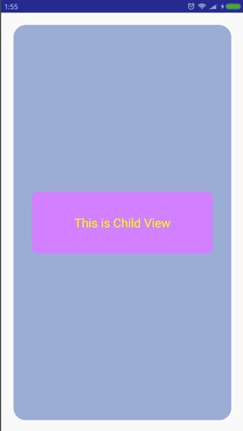

# RoundRectLayout

对加入到RoundRectXXX内的子View来讲，只要其边缘与Layout的四个角重合就会变成圆角

使用示例：

```
<?xml version="1.0" encoding="utf-8"?>
<cn.wang.widget.roundrectlayout.RoundRectLinearLayout
    xmlns:android="http://schemas.android.com/apk/res/android"
    xmlns:app="http://schemas.android.com/apk/res-auto"
    android:layout_width="match_parent"
    android:layout_height="match_parent"
    android:orientation="vertical"
    app:roundRectRadius="20dp"
    app:roundRectBackground="#FFAABBDD"
    android:padding="30dp"
    android:layout_margin="20dp"
    android:gravity="center">

    <cn.wang.widget.roundrectlayout.RoundRectLinearLayout
        android:layout_width="match_parent"
        android:layout_height="wrap_content"
        app:roundRectRadius="10dp"
        app:roundRectBackground="#FFDD99FF"
        android:orientation="vertical"
        android:layout_gravity="center">

        <TextView
            android:layout_width="match_parent"
            android:layout_height="100dp"
            android:text="This is Child View"
            android:textSize="20sp"
            android:textColor="#FFFFFF00"
            android:gravity="center"/>


    </cn.wang.widget.roundrectlayout.RoundRectLinearLayout>


</cn.wang.widget.roundrectlayout.RoundRectLinearLayout>
```

